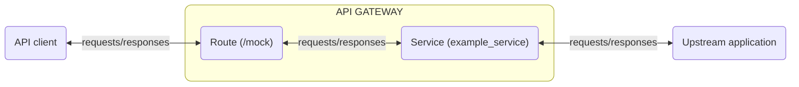

This article explains the basics of Gateway Services, and how they are used to
set up your API on the API Services Portal.

A Gateway Service represents an external upstream service or API that
{{ glossary_tooltip term_id="kong-gateway" text="Kong" }} manages. This could be
a service hosted internally within your infrastructure or an external service
hosted elsewhere, for example, a data transformation microservice, a billing
API, and so on. Kong acts as a proxy for these services, enabling you to control
access, manage traffic, apply security policies, and more.

The high level overview below shows requests arriving at routes and being
forwarded to services, with responses taking the opposite pathway:

The main attribute of a Gateway Service is its URL. You can specify the URL with
a single string, or by specifying its protocol, host, port, and path
individually.

## Service and Route interaction

Services, in conjunction with Routes, let you expose your upstream services to
clients with Kong Gateway. Kong Gateway abstracts the service from the clients
by using routes. Since the client always calls the route, changes to the
services (like versioning) don’t impact how clients make the call. Routes also
allow the same service to be used by multiple clients and apply different
policies based on the route used.

For example, let's say you have an external client and an internal client that
need to access the `hwservice` service, but the external client should be
limited in how often it can query the service to assure no denial of service. If
a rate limit policy is applied to the Gateway Service to restrict external
client requests to the service, the internal client is limited as well. Routes
solve this problem.

In the example above, two routes can be created, say `/external` and
`/internal`, and both routes can point to `hwservice`. A policy can be
configured to limit how often the `/external` route is used and the route can be
communicated to the external client for use. When the external client tries to
access the service via Kong Gateway using `/external`, they are rate limited.
But when the internal client accesses the service via Kong Gateway using
`/internal`, the internal client will not be limited.

## Next steps

If you would like to dive deeper or start implementing Gateway Services, check
out the following resources:

How-to Guides

- [Create a Gateway Service](/how-to/create-gateway-service.md)

Extend Service functionality with plugins

- [Plugins](/concepts/plugins.md)

External Resources

- [Kong: Get Started with Kong, Services and Routes](https://docs.konghq.com/gateway/latest/get-started/services-and-routes/)
