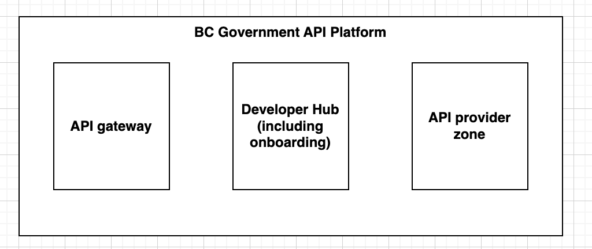

# API Platform

## Overview

The BC Gov API Platform is the trusted and authoritative "front door" for government APIs ([What is an API?](../developer/what-is-an-api)).

APIs are the building blocks of connected services. They allow different systems, applications, and data sources across BC government ministries and the broader public sector to talk to each other. Supporting connected services is a key part of the B.C. Government's Digital Plan and Data Management Policy.

The API platform makes it easy for developers to build connected services, and for ministries to publish, secure, and manage their APIs.

The platform provides a consistent experience for API consumers and API providers that [makes integration easier](../developer/api-management-vision) and supports [Open Data](https://www2.gov.bc.ca/gov/content/data/open-data) policies.

## Components

The API platform has three components:

- the API gateway
- the developer hub (including digital onboarding)
- the API provider zone

### API gateway

The API gateway is the runtime component of the API platform, and includes:

- API proxies – the front door for each API, handling security and rate limiting
- an authorisation server – in partnership with the [SSO team](https://bcgov.github.io/sso-requests), this authenticates and authorises the calling application and end user, and is integrated with [IDIM](https://www2.gov.bc.ca/gov/content/governments/services-for-government/information-management-technology/identity-and-authentication-services)
- logging, monitoring and alerting – tools to keep the platform healthy

> Excluded:
>
> - a translation layer - an optional layer for lightweight transformations of API requests and responses
> - sandboxes - hosted stubs that API consumers can use for early testing

### Developer hub (including digital onboarding)

The [developer hub](../developer/hub) is for **API consumers** - people building front-end applications that consume APIs. It's not just for programmers and architects – it's also for product owners, business analysts, delivery leads, testers, CTOs and entrepreneurs.

It includes:

- getting started information, including tutorials
- a searchable API directory
- a digital onboarding service for access to production

Some of the features require you to create a developer account.

> Exclusions:
>
> - detailed API specifications
> - self-service access to test environments
> - help and support, including our developer community for support-in-the-open and peer-to-peer support

### API provider zone

The [API provider zone](https://bcgov.github.io/aps-infra-platform/) is for **API providers** - people building back-end applications that expose APIs, including:

- technical and non-technical people

It includes:

- self-service API provider guidance, both technical and process
- technical support
- non-technical support
- lightweight governance - to ensure APIs are built to a consistent quality
- a portal for gateway and consumer access management

Currently, you need an IDIR account to access parts of the API provider zone. To get access, see [getting started](#getting-started).

## Service level

The API platform is available and supported during core business hours, with an option to support 24 hours a day, 365 days a year.

It has a guaranteed availability of 99.95%, although actual availability is much higher - for example in 2022 it was 99.995%.

## Benefits

The API platform is part of our [mission to make integration easier](../../developer/api-management-vision), and provides benefits for both API consumers and API providers.

### Benefits for API consumers

For API consumers, the API platform provides:

- a consistent, modern experience using open standards such as REST and OAuth 2.0
- self-service and immediate access to test environments
- quicker and easier access to production using our digital onboarding service
- access from the internet, as well as internal BC Government networks
- documentation that is clear, consistent and comprehensive, using OAS for API specifications

> Exclusions:
>
> - a single point of contact for help and support when you’re stuck

### Benefits for API providers

For API providers, the API platform provides:

- quicker and more predictable delivery using our easy-to-follow API delivery process
- get started quickly using our one-click API platform set-up tool
- full customisation, with plug-and-play modules for authorisation, rate limiting, logging, monitoring and alerting
- quick and easy API documentation using OAS (aka swagger)
- comprehensive self-service technical and non-technical guidance in our API provider zone
- dedicated technical and non-technical support for when you’re stuck

One API provider said they were 'frankly astonished' at how quickly they were able to set up their API on our platform.

> Exclusions:
>
> - a full CI/CD pipeline, including multiple path-to-live environments

### Benefits to the wider BC Government

By making integration easier, we provide a number of benefits to the wider BC Government:

- API providers and consumers can get useful, integrated software to market quicker and cheaper
- ...which gives them more time to add and improve features
- the lower barrier to entry allows more software providers into the marketplace
- ...which creates an environment for digital innovation to thrive
- ...and pushes down software costs to the BC Government
- Citizens have a wider variety of well-integrated software to choose from
- ...which means they are more likely to have the information they need, when and where they need it

## History and Status

The API platform was launched in 2020...

## Case studies

For details of case studies, see...

## Technology stack and open source

Our API platform has a hybrid technology stack, using a blend of proprietary products, open source products and bespoke code.

Specifically, at the time of writing (15 Nov 2023), we are using:

- Kong Gateway OSS
- Keycloak
- GitHub
- Openshift Private Cloud
- Terraform
- Grafana and Prometheus

Our bespoke code, including the code for all our API proxies, is mostly coded in the open and is hosted in our GitHub repositories. We welcome contributions from the developer community - but we're not always watching out for them, so if you do raise a pull request, you might want to contact us to let us know.

## Getting started

### API consumers

To get started as an API provider, see the [developer hub](../developer/hub).

### API providers

To get started as an API provider, see [Building APIs](./building-apis).
