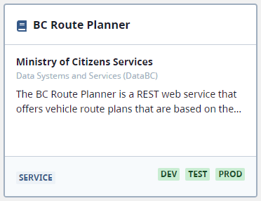

# API Discovery

## What is the API Directory?

The [API Directory](https://api.gov.bc.ca/devportal/api-directory) enables you to package your APIs and make them available for discovery by developers and other API consumers, across BC Government and beyond.

By listing your API in the API Directory, you also gain access to tools for managing your API consumers through access requests and approvals.

## API Listings

The API Directory shows available APIs through API listings. Each listing features one API and is visible as a card on the API Directory's main page.



Cards show basic metadata about the API: the API name (`title`), associated ministry (`organization`), description (`notes`), and available environments. This metadata is defined in a `dataset`.

Despite the name `dataset`, don't think that all API's need to serve *data*. Many API's provide services, for example, the [BC Route Planner API](https://api.gov.bc.ca/devportal/api-directory/740?preview=false) returns vehicle routes between start and end points.

!!! info
    Think of `datasets` as API metadata records.

Clicking on the API name opens the full API listing details.


Here, additional metadata details defined in the `dataset` are visible, as well as the associated `products` which consumers can request access to.

!!! info
    `products` bundle one or more gateway services which are protected in the same way. They are used to manage consumer access.

## Sharing Your API

API Listings in the Directory can be created and managed via:

- ⭐ **Command Line Interface (CLI)**: See the [Quick Start guide](../guides/owner-journey.md) for instructions on downloading the CLI and logging in.
- **Directory API**: Go to [Gateway Administration](../resources/gateway-admin.md#directory-api) for links to the Directory API specs and Swagger UI.
- **Web user interface (UI)**: Visit the [API Services Portal](https://api.gov.bc.ca/) and login to the API Provider zone.

!!! warning "Web UI limitations"
    At this time, not all steps required to create an API listing are possible through the web UI. We recommend using the CLI.

### Environments

All API Directory functionality is accessible in both the `test` and `production` environments. While you are encouraged to utilize the `test` environment for experimentation and training purposes, if you already know the details of the API you're building, you can add it directly to the production Directory.

| Environment     | API Services Portal Directory Link                               |
| --------------- | ---------------------------------------------------------------- |
| TEST / TRAINING | https://api-gov-bc-ca.test.api.gov.bc.ca/devportal/api-directory |
| PRODUCTION      | https://api.gov.bc.ca/devportal/api-directory                    |

### Setup a Draft Dataset

First, we need a draft dataset with metadata about your API. This information helps consumers find your API in the Directory. If your API is already listed in the [BC Data Catalogue](https://catalogue.data.gov.bc.ca/), skip ahead to [Link Your Dataset to a Product](#link-your-dataset-to-a-product).

Start by writing up a draft dataset in a local YAML file (if using the CLI) or JSON file (if using the API). Here is the schema, omitting some optional fields:

=== "YAML Template (w/ field descriptions)"
```yaml
kind: DraftDataset # object type for gwa-cli use
name: my-draft-dataset # unique dataset name, not displayed
title: Useful API # API title shown on the Directory
notes: A handy API with many uses. # API description, supports Markdown formatting
tags: [useful, data, openapi] # keywords, may be used for search in future
organization: ministry-of-citizens-services # ministry or agency associated with the API (see https://api.gov.bc.ca/ds/api/v2/organizations for options) - this must match the organization associated with the namespace
organizationUnit: databc # organization business sub-unit (see https://api.gov.bc.ca/ds/api/v2/organizations/<organization> for options)
license_title: Open Government Licence - British Columbia # see https://bcgov.github.io/data-publication/pages/dps_licences.html for licensing options
view_audience: Government # who can access the API
security_class: PUBLIC # OCIO Information Security Classification Standard, see https://www2.gov.bc.ca/assets/gov/government/services-for-government-and-broader-public-sector/information-technology-services/standards-files/618_information_security_classification_standard.pdf
record_publish_date: "2021-05-27" # date when the API was published
```
=== "YAML Template"
```yaml
kind: DraftDataset
name: my-draft-dataset
title: Useful API
notes: A handy API with many uses.
tags: [useful, data, openapi]
organization: ministry-of-citizens-services
organizationUnit: databc
license_title: Open Government Licence - British Columbia
view_audience: Government
security_class: PUBLIC
record_publish_date: "2021-05-27"
```
=== "JSON Template"
```json
{
  "name": "my-draft-dataset",
  "title": "Useful API",
  "notes": "A handy API with many uses.",
  "tags": [
    "useful",
    "data",
    "openapi"
  ],
  "organization": "ministry-of-citizens-services",
  "organizationUnit": "databc",
  "license_title": "Open Government Licence - British Columbia",
  "view_audience": "Government",
  "security_class": "PUBLIC",
  "record_publish_date": "2021-05-27"
}
```

Check our [source code](https://github.com/bcgov/api-services-portal/blob/dev/src/batch/data-rules.js#L116) for up-to-date data rules for `DraftDatasets`.

Now it's time to publish the dataset:

+++ CLI
1. Login - `gwa login`
2. Set the namespace - `gwa config set namespace <namespace-name>`
3. Publish the draft dataset - `gwa apply -i <draft-dataset.yaml>`

You should see `✔ [DraftDataset] <dataset-name>: created`
+++ API (Swagger UI)
1. [Login](https://api.gov.bc.ca/login?identity=provider&f=%2F) to the API Services Portal as an API Provider.
2. Click `Help` in the top right, then `API Docs` to open the [Swagger UI](https://api.gov.bc.ca/ds/api/v2/console/).
3. Under API Directory, click the `PUT /namespaces/{ns}/datasets` [Update Dataset](https://api.gov.bc.ca/ds/api/v2/console/#/API%20Directory/put-dataset) accordion item.
4. Click `Try it out`
5. Enter your namespace
6. Copy your JSON `dataset` into the Request body
7. Click `Execute`
8. Scroll down and ensure a `200` Response was received
+++

### Link Your Dataset to a Product

If you've already worked through the [Quick Start guide](../guides/owner-journey.md) or set up a gateway service, you may already have a `product`. In this case, we can associate the `product` with a `dataset`:

1. Open the [Products](https://api.gov.bc.ca/manager/products) page in the API Services Portal.
2. Click the ellipsis (`...`) next to `Add Env`, select `Edit Product`.
3. Customize the `Product Name`, if desired.
4. In the `Link to BC Data Catalogue` dialogue, enter the `title` of your newly created, or existing BCDC, dataset.
!!!
Search is exact. Be mindful of spaces and case.
!!!
5. Click Update.

Preview your new API listing by opening the API Directory and clicking the **Your Products** tab. Confirm everything is as desired.


#### Setup a New Product

If you haven't added a product yet, follow these steps and then link your dataset:

+++ CLI
1. Create a product configuration using the YAML template below.
   
   Specify your dataset by `name` in the config - `dataset: my-draft-dataset`
2. Publish the product - `gwa apply -i <product.yaml>`
+++ Web UI
1. Navigate to Namespaces -> Products.
2. Click `New Product` in the top right.
+++

+++YAML Template
<!-- TODO: describe product fields -->
```yaml
kind: Product
appId: 'D31E616FE1A6'
name: Useful API
dataset: my-draft-dataset
environments:
  - name: dev
    appId: '4221AAF6'
    active: false
    approval: false
    services: [my-service-dev]
```
+++
### Enabling for Discovery

Once the content is complete and you have applied the appropriate controls to your API, you are ready to make it available on the API Directory.

!!!Prerequisite: Add Organization
Before sharing your API on the API Directory, you must add your Organization and Business Unit to your namespace. If you have yet to complete this you will see a banner on the `Namespaces` page on the API Service Portal asking you to `Add Organization`. You will then need to wait for approval from the Organization Administrator.
!!!

Enable an environment to display the API in the API Directory. You can individually enable each environment (dev, test, prod). 

Enable environments by either updating the Product Environment configuration YAML to `active: true`, or on the API Services Portal -> Product page -> Edit the Environment details -> check `Enable Environment`.

### View Your Product in the API Directory

Find your API in the `API Directory`.

It is now ready to receive access requests from the community!

Documentation on how to grant and manage your API consumer access is coming soon.